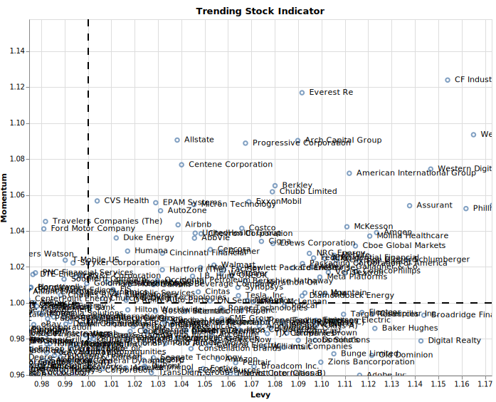

# David Harrieder
On this website there's a slight overview about my current activities but mainly this website focuses on the assertion of the Trendcompass SP500, with which you have the ability to analyze past financial stock data. 
The shown two dimensional graphic might look confusing at first sight. Please note that the graphic, accessed through the website, is responsive. With this feature you have the ability to move as well as zoom through the whole visualization hence receiving exactly the data you want. 

## [Visit my Website now](https://nikolausdavid.github.io)
[Link to the Website](https://nikolausdavid.github.io)

### Data
The Data is updated regularly, but at least once a week. 
